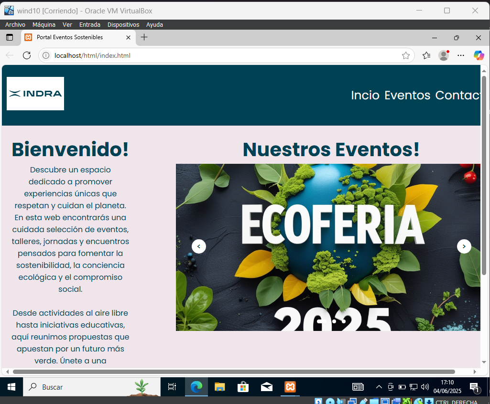
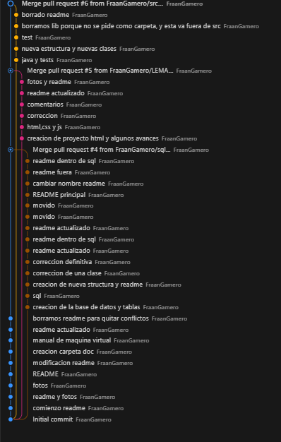

# Prácticas Indra - Fran Gamero

Repositorio con las prácticas realizadas para el proceso de formación DUAL en Indra, por Francisco Gamero Trujillano.

---

## Descripción

Este repositorio contiene scripts SQL, 
Entre los recursos que encontrarás:

- Creación y manipulación de bases de datos y tablas.
- Inserción y actualización de datos.
- Gestión de usuarios y permisos en MySQL.
- Consultas SQL de distintos niveles de complejidad.
- Diseño de esquemas relacionales para un portal de eventos.
- Scripts con transacciones para mantener la integridad de los datos.

---

## Lenguaje de Marcas

Para la parte de Lenguaje de Marca, he creado una carpeta [/HTML](html) la cual consta con 3 archivos html, index.html, eventos.html y detalle_evento.html . Acompañado de 4 carpetas, [/css](html/css) , [/js](html/js), [/img](html/img), y [/fonts](html/fonts) . Teniendo asi una mejor esrtuctura.

Aqui podemos ver una imagen desde la maquina virtual del index.html

Para ver mas detalladamente, podemos ir a la carpeta html y ver su readme

## Base de Datos

Para poder trabajar en el apartado de base de datos, me organice en 3 pequeñas fases:

1) Análisis inicial: Lectura y comprensión de los requisitos, identificando las entidades principales y sus respectivos atributos.

2) Diseño lógico y conceptual: Creación del Modelo Entidad-Relación (MER) y posterior transformación al Modelo Relacional.

3) Implementación: Construcción de la base de datos en un entorno local,(localhost) utilizando XAMPP, junto con la creación de los scripts SQL necesarios para su funcionamiento.

> .[!NOTE]. 
>
> para verlo mas detalladamente puedes ir al README de sql

## Programacion

En este apartado Programacion, lo primero que hice fue organizar el proyecto, separandolo con la arquitectura M-V-C (Modelo, Vista, Controlador) 

- ### Modelo
En el paqute modelo nos podemos encotrar con 7 clases disintas. Las cuales 6 de ellas son las entidades dadas y sus respectivos atributos.La séptima clase, Modelo.java, se encarga de gestionar los datos creando y almacenando objetos de las entidades mediante estructuras ArrayList

- ### Vista

Dentro del paquete vista nos encontramos con una clase, la cual se encarga de crear, el Menu del programa, haciendo de forma visual las diferentes consultas que puedes hacer

- ### Controlador

Por ultimo, nos encontramos con el paquete controlador. Este, esta definido por dos clases. Controlador.java el cual se encarga de ejecutar todos los metodos creados y Main.java, el cual se encarga de iniciar el programa

## Sistemas Informaticos

Para la parte de sistemas informaticos, me he encargado de crear una maquina virtual de Windows 10 usando, Oracle VM Virtual Box. Esta se podra ver en la carpeta doc en [Manual-Virtual-Machine-w10.pdf](doc/Manual-Virtual-Machine-w10.pdf) o pinchando sobre este

## Evidencias de git Grap

