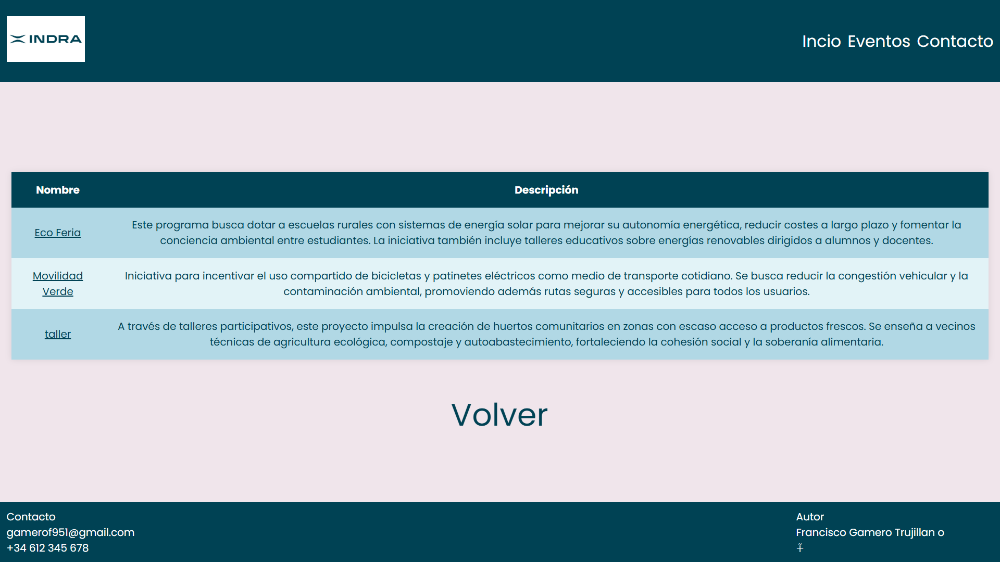

# practicas-indra-gamero
Repositorio de Francisco Gamero Trujillano, creado para las practicas de Indra 24/25

Para la parte de Lenguaje de Marca, he creado una carpeta [/HTML](html) la cual consta con 3 archivos html, index.html, eventos.html y detalle_evento.html . Acompañado de 4 carpetas, [/css](html/css) , [/js](html/js), [/img](html/img), y [/fonts](html/fonts) . Teniendo asi una mejor esrtuctura.

Al iniciar la web nos mostrará es el inicio de esta, la cual esta compuesta por un navbar, este contiene un logo en la parte izquierda, el cual al hacer click sobre el nos mandaria nuevamente a la pagina inicial.

Este navbar, esta acompañado a su derecha con 3 textos, Inicio, que tiene la misma función que el logo. Contacto, que no tiene ninguna funcionalidad, pero esteticamente me parecia mas atractivo. Y por ultimo tenemos Evento, el cual al hacer click nos enviara a una nueva pagina Evento
---

Esta pagina de Eventos contiene una tabla con los eventos correspondientes Nombres de los eventos y una breve descripcion.  Si hacemos click sobre el nombre del Evento, esta nos llevara a una pagina nueva, la cual solamente nos mostrará el evento al que hayamos clickado.

Tambien podemos Observar debajo de la tabla vemos la palabra "Volver". El cual se encarga de volver a la pagina anterior (index.html) 

---

Al clickar sobre un evento, como por ejemplo Movilidad Verde, nos llevara a una nueva pagina, en esta nos saldra toda la informacion sobre este. Esta informacion esta guardada en el js de . Tambien podemos observar nuevamente "Volver" el cual nos llevara a la pagina anterior, en este caso evento.html

