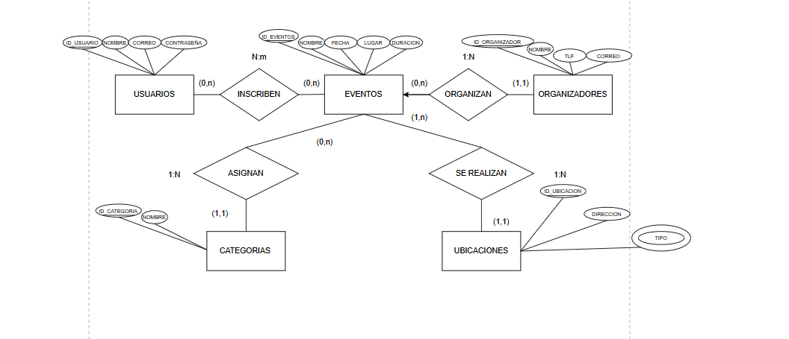
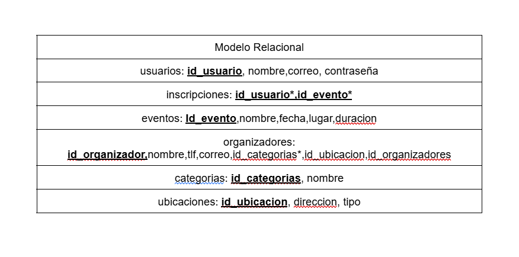
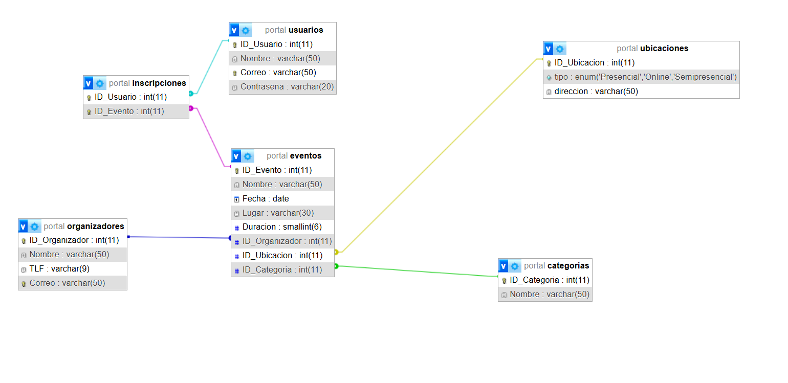

# Diseño lógico y conceptual

- para el Diseño lógico y conceptual he Creación del Modelo Entidad-Relación (MER)  
    
  y posteriormente lo he pasado transformación al Modelo Relacional.  
  

---

# Parte de SQL

en la parte de SQL podemos observar que he creado 4 scripts distintos. entre ellos podemos observar:

## portal.sql
- este contiene la creacion de la base de datos y sus respectivas tablas.

Asi es como quedarian las relaciones, viendolo desde la pestaña "Designer"
 

## consultas.sql
- este contiene 2 consultas creada

## crearUsuariosOrganizadores.sql
- este contiene la creacion de varios organizadores y usuarios. ademas le otorga los permisos que les haga falta

## agregarDatos.sql
- este contendra la inserccion de datos
